# Kafka. От источника до хранилищ данных

## Начало

`ORG_NAME` - большая геораспределенная компания, в России заводы располагаются в г.Липецк, г.Калуга, Алтай.
Перед нами стояла задача спроектировать и внедрить шину Kafka в группе компаний `ORG_NAME`, проработав требования и учтя особенности компании.

Kafka планировалось использовать для обмена данными между технологическим и бизнес-сегментом, для обмена данными между системами, для сбора логов и трейсов, сбора телеметрии с производства.
Мы сделали централизованные кластера Kafka в бизнес-сегменте, отдельные кластера под данные и интеграции ИС, под логи и трейсинг, под тренды и локальные к производству кластера.  

Целевая/Получившаяся схема:
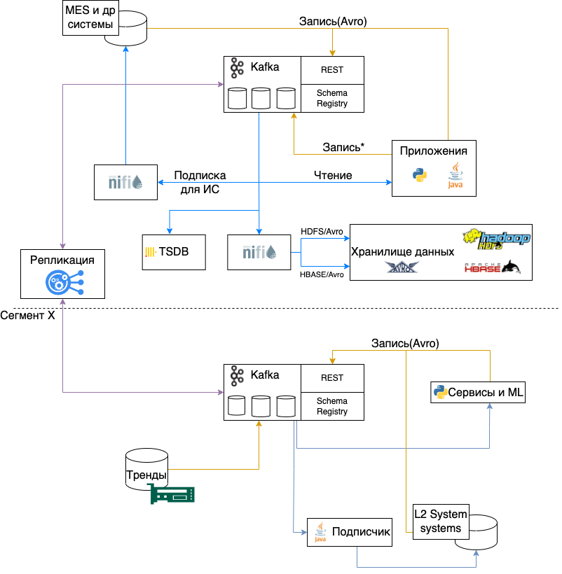


Kafka можно назвать одним из основных, базовых, компонентов. Подходы и принципы, заложенные в начале, живут очень долго и их очень сложно поменять.
Поэтому очень важно на начальном этапе сразу продумать как пользователи будут авторизоваться в разных кластерах, как будут именоваться топики, в каком формате передаваться сообщения, как обеспечить контроль качества схем и данных.

Можно выделить несколько уровней зрелости систем в зависимости от степени автоматизации:
- заявки, ручник и длительное ожидание
- автоматизированный  инструменты администраторов, написаны тесты к входной информации от пользователей
- все запросы пользователей автоматизированы 
- приложения-потребители могут жить без поддержки (будь то перевыпуск сертификата или CA, или смена пароля, все для пользователей ИС происходит автоматически)
Мы сейчас находимся где-то между 2-ым и 3-им уровнем и кажется, что уже можем поделиться тем, к чему пришли.


## Кластера и аутентификация

Каждому кластеру присваивается имя вида `XXX-Y`, состоящее из номера группы(XXX) и суффикса(Y) - идентификатора среды.

Номера группы выдаются последовательно. В группе может быть только один кластер с продуктивной средой. Условлено, что среда `prod` всегда имеет суффикс `0`, `test` или `dev` - любые другие числа.

Например, кластерная группа `000`, это наш центральный кластер под данные. Его продуктивный кластер Kafka имеет имя `000-0`, его дев кластер `000-1`, а тестовый кластер - `000-2`.
Имена кластеров уникальны в рамках компании. Это позволяет гарантировать уникальность имен топиков в рамках компании, определять кластер по имени топика, реплицировать топики без конфликта имен.

### Аутентификация

Самый универсальный способ аутентификации - SSL, позволяет аутентифицировать клиентов даже там, где нет, например, контроллера домена и поддерживается всеми библиотеками и ПО, которое мы используем.
Подсмотрев как это было сделано в Booking(спасибо Александру Миронову) мы разработали следующий подход к CA и сертификатам.

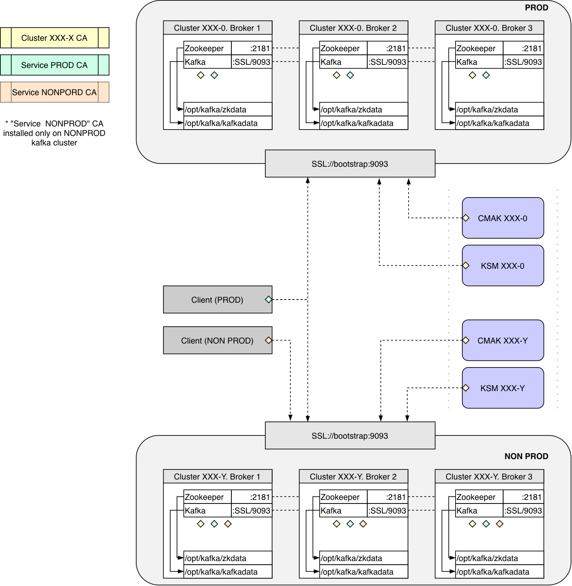

На каждый кластер выпускается свой CA(Cluster XXX-X CA). Этот CA выпускает сертификаты для брокеров и сервисов администрирования([KSM](https://github.com/conduktor/kafka-security-manager)).

Также два CA для сервисов: Service PROD и Service NONPROD.

На продуктивные кластера Kafka устанавливается два CA: 
* Cluster XXX-X CA
* Service PROD CA

На тестовые устанавливается три CA: 
* Cluster XXX-X CA
* Service PROD CA
* Service NonPROD CA

Таким образом, приложения, у которых сертификат выпущен `Service PROD CA`, могут подключаться и к продуктивным, и к непродуктивным кластерам Kafka. Последнее сделано, чтобы можно было реализовать сервис по наполнению тестовых сред на основе данных из продуктивной среды, как пример.
Приложения с сертификатами, выданными `Service NonPROD CA`, могу подключаться только к непродуктивным кластерам.
Отдельный CA для сервисов позволяет приложениям с один сертификатом подключаться к разным кластерам.

Для создания CA и выпуска сертификатов мы используем [Lemur](https://github.com/netflix/lemur), опять же, (спасибо Александру Миронову), а также Vault.
Lemur предоставляет авторизацию, выпуск сертификатов через Rest, хранение сертификатов и выполняет их доставку в Vault.

Vault используем не только для хранения секретов, но и для выпуска сертификатов для сбора логов с машин. Каждая ВМ получает токен с которым может выпустить себе сертификат. Сертификат выпускается на 7 дней и автоматически ротируется с помощью [Consul Template](https://github.com/hashicorp/consul-template).
Скорее всего, в будущем мы откажемся от Lemur и полностью перейдем на Vault.

Для управления ACL мы используем подход GitOps: Git -> CI -> [KSM](https://github.com/conduktor/kafka-security-manager).

В качестве инструментов для администрирования используем:
* [AKHQ](https://github.com/tchiotludo/akhq)
* [Kafdrop](https://github.com/obsidiandynamics/kafdrop)
* [CMAK](https://github.com/yahoo/CMAK)


## Мониторинг

### Хосты и сервисы

Наш основной стек мониторинга  - Prometheus и VictoriaMetrics. 
Для сбора метрик с Java сервисов Kafka и Kafka Rest, мы используем Prometheus [JMX Exporter](https://github.com/prometheus/jmx_exporter). Он запускается как Java agent и предоставляет http интерфейс на localhost с метриками JVM.
Zookeeper начиная с версии 3.6 [нативно](https://github.com/apache/zookeeper/pull/977/files) умеет предоставлять метрики в Prometheus формате.

На виртуальных машинах в качестве агентов сбора метрик используется [Telegraf](https://github.com/influxdata/telegraf).

Он собирает:
- метрики хоста
- метрики локальных экспортеров (JMX Exporter, Zookeeper) 
- [cтатус сервисов systemd](https://github.com/influxdata/telegraf/tree/master/plugins/inputs/systemd_units) для Kafka и Zookeeper.
- [статус и метрики контейнеров docker](https://github.com/influxdata/telegraf/tree/master/plugins/inputs/docker) для KafkaRest, SchemaRegistry, NGiNX, RA.
- [срок до истечения сертфиикатов](https://github.com/influxdata/telegraf/tree/master/plugins/inputs/x509_cert)

Про мониторинг Zookeeper отлично все собрано у Altinity: [Zookeeper monitoring](https://kb.altinity.com/altinity-kb-setup-and-maintenance/altinity-kb-zookeeper/zookeeper-monitoring/)

### Kafka REST

Для Kafka-Rest мы собираем статистику по http кодам ответов с помощью  модуля nginx [VTS](https://github.com/vozlt/nginx-module-vts) в разрезе `dataset name`(см. соглашение об именовании топиков).

Пример `nginx/conf.d/kafka-rest.conf`:
```
map $uri $namespace {
    ~*/topics/000-0\.([a-z0-9-]+)\..+$  $1;
    default      'unmatched';
}

server {
   ...
   host_traffic_status_filter_by_set_key $host $namespace;
   ...
}
```

А также, мы используем [Blackbox Exporter](https://github.com/prometheus/blackbox_exporter), с помощью которого периодически отправляем тестовое сообщение в kafka-rest и проверяем код ответа. Данный метод имеет свои слабые стороны (например, Avro схема кэшируется на стороне Kafka-Rest и проблемы со Schema Registry можно не заметить). Улучшение этого мониторинга уже запланировано.

### Внешний мониторинг Kafka

В качестве агента для мониторинга кластера снаружи мы используем: [KMinion](https://github.com/cloudhut/kminion).
Его функционал очень богат, он позволяет видеть статистику по кластеру в целом, топикам, консьюмер группам, размер топиков на диске и даже есть end-to-end мониторинг.

Для деплоя и управления всеми инструментами администрирования мы  используем подход GitOps и деплоим инструменты в OpenShift (очень удобно, что все инструменты можно закрыть с помощью OpenShift OAuth).

### Публичные дешборды

Возможность самостоятельной диагностики и открытость - основной наш подход.
В нашем централизованном сервисе мониторинга всем авторизованным пользователям доступны подготовленные дешборды для Kafka и KafkaRest.

Топ 3 вопросов:
- есть ли данные в топике
- пишутся ли данные
- все ли нормально с Kafka Rest

На первые два вопроса помогают ответить стандартные [дешборды KMinion](https://github.com/cloudhut/kminion#-grafana-dashboards). Мы их слегка изменили, добавив возможность выбора кластера и среды.

Для ответа на третий вопрос, мы сделали дешборд из метрик Nginx VTS.
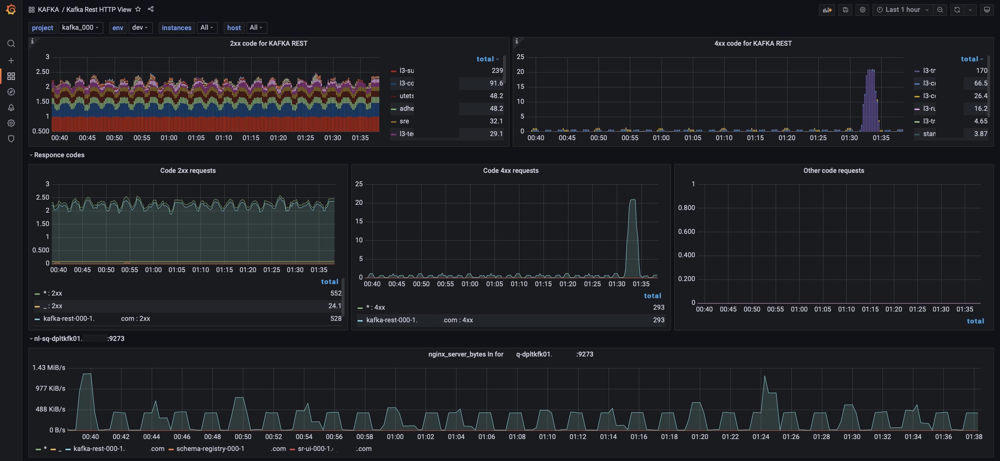

## Соглашение об именовании топиков

Следующим важным шагом была разработка концепции именования топиков.

Мы пришли к следующему формату:

`<cluster name>.<dataset name>.<message type>.<data name>.<version>`

Где:
  * `cluster name` - уникальное имя кластера Kafka вида XXX-X. Для реплицированных из кластера YYY-Y: XXX-X-YYY-Y.
  * `dataset name` - условно - имя базы данных. Используется как категоризация для группировки топиков вместе. Уникальный в рамках всех кластеров.
  * `message type` - тип сообщений, сообщает как данные должны быть интерпретированы или использованы. Выбирается из справочника MessageType.
  * `data name` - сущность аналогичная "таблица" в БД, название потока данных.
  * `version` - версия данных. Для случая обратно не совместимых изменений в схеме данных, начинается с 0.

Для валидации, что имя топика соответствует конвенции, мы используем следующий regexp:
`^\d{3}-\d(-\d{3}-\d)?\.[a-z0-9-]+\.(db|cdc|bin|cmd|sys|log|tmp)\.[a-z0-9-.]+\.\d+$`

### Справочник MessageType

|Название|Интерфес записи| Формат сообщения|Публичный|Комментарий| 
|----|----|-----|-----|-----|
| db | KafkaRest | Avro | + | для фактов, неизменяемых событий (данные датчиков, действия пользователей и т.д.)|
| cdc | KafkaRest| Avro | + | топик типа Compaction. Содержат полный набор данных и получают изменения к ним. Могут использоваться для пере заливки хранилищ и кэшей, справочников. Key обязателен |
| cmd  | KafkaRest| Avro | + | содержит команды, используется в реализации паттерна Запрос-Ответ |
| bin | KafkaRest | Bin | + | бинарные данные (Content-Type: application/vnd.kafka.binary.v2+json). использовать в исключительных ситуациях. Рекомендуется перед версией топик в `data name` в конце добавлять расширение данных (например: `000-0.dataset-name.bin.name.crt.0` |
| sys | Binary | Bin | - | внутренние топики, используемые только этим сервисом и не интересные другим
| log | Binary | Bin | - | - для передачи логов (Log4j, Syslog, FluentBit)
| tmp | Binary | Bin | - | для  временных или промежуточных данных|

Для упрощения понимания концепции и пока не сделан Self-Service для Kafka на Портале, мы сделали flow диаграмму:
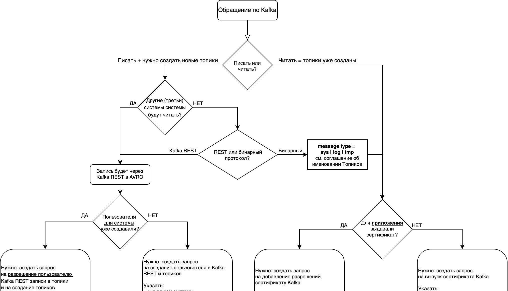

Schema Registry на продуктивных  и тестовых кластерах доступна только в режиме Read-Only, те все могут получить любую схему, но зарегистрировать можно только через Kafka Rest. Dev Schema Registry доступна без какой-либо авторизации и ограничений.
Схемы продуктивных сред на регулярной основе выгружаются в Confluence для возможности быстро посмотреть схему топика или текстового поиска по ним.

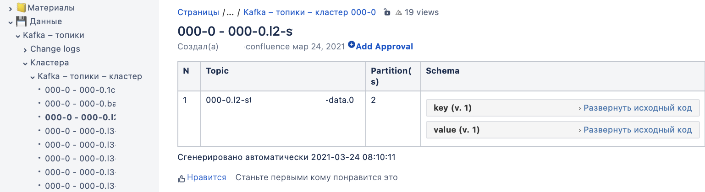

Пара статей про подходы к именованию топиков:
- [Apache Kafka: Topic Naming Conventions/2020](https://devshawn.com/blog/apache-kafka-topic-naming-conventions/)
- [Kafka Topic Naming Conventions/2017](https://cnr.sh/essays/how-paint-bike-shed-kafka-topic-naming-conventions)

## Kafka Rest Proxy

Изначально, в компании интеграцию с Kafka на запись для систем сделали через NiFi: http интерфейс, формат данных JSON, схемы к сообщениям хранились так же в NiFi. В случае несоответствия сообщения схеме, данные все равно записывались, но помещались в очередь "битые".
Данный подход имел ряд проблем: NiFi вызывал вопросы, были проблемы с битыми сообщениями и аргументами "с нашей стороны пуля вылетела". Хотелось перепроектировать интеграции так, чтобы пуля "не вылетала", если она не соответствует контракту.

PS. На мой взгляд, единственный, кто может обеспечить качество данных, — это источник (и, как мне кажется, кто знает, как их лучше уложить/архивировать).

Итого, задачи:
- выбор бинарного формата, чтобы в стандартное сообщение в 1Мб помещалось больше полезных данных
- эволюция схем, предоставить отправителю возможность управлять схемами и версиями
- не принимать сообщения в Kafka, если не соответствуют контракту
- как можно большая поддержка и распространенность формата, наличие готовых инструментов, библиотек, поддержка формата в Hadoop

По формату решили использовать Avro. Для предоставления возможности записи в Kafka через HTTP протокол, контроля формата сообщений и хранения схем, мы выбрали связку [Confluent Kafka Rest](https://docs.confluent.io/platform/current/kafka-rest/index.html) и [Confluent Schema Registry](https://docs.confluent.io/platform/current/schema-registry/index.html).

Для авторизации перед Kafka-Rest, мы написали программу на Go, которая выполняет следующие функции:
- проверяет, что имя топика соответствует конвенции имен
- проверяет авторизацию и аутентификацию пользователя для топика(или схемы)
- проверяет Content-Type для топика (обязывает отправлять Avro)

Пример конфигурации (разрешаем пользователю l4-example создание и запись в топики его ИС):

```json
auth:
  prefix: /topics/
  urlvalidreg: ^\d{3}-\d(-\d{3}-\d)?\.[a-z0-9-]+\.(db|cdc|bin|cmd|sys|log|tmp)\.[a-z0-9-.]+\.\d+$
  acl:
  - path: ^000-0\.l4-example\.db\.+?$
    users:
    - l4-example
    methods:
    - post
    contenttype:
    - application/vnd.kafka.avro.v2+json
```

Авторизацию интегрировали в nginx для обоих сервисов (rest и schema regestry), через опцию auth_request

Пример секции auth_request:

```
...
 auth_request /auth;
 location = /auth {
   internal;
   proxy_pass http://ra:8080;
   proxy_pass_request_body     off;
   proxy_set_header Content-Length "";
   proxy_set_header X-Original-URI $request_uri;
   proxy_set_header X-Original-Method $request_method;
   proxy_set_header Host $http_host;
   proxy_set_header X-Real-IP $remote_addr;
   proxy_set_header X-Forwarded-For $proxy_add_x_forwarded_for;
   proxy_set_header X-Forwarded-Proto $scheme;
   proxy_set_header X-Service "kafka-rest";
 }
```

Сам проект: [ra](https://github.com/e11it/ra).

Kafka Rest и Schema Registry работают в HA режиме и позволяют горизонтально масштабироваться.

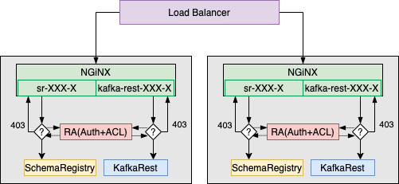

## Репликация данных в централизованный кластер

Кафки производства находятся за Firewall. Мы реплицируем  данные из этих Kafka в централизованный кластер, чтобы уменьшить количество клиентов, которые обращаются в технологический сегмент, и собрать все данные в одном кластере.

Для репликации мы используем написанную нами на python программу. Она умеет реплицировать топики  в формате Confluent-Avro из одного кластера в другой с минимальными изменениями и поддерживает Exactly Once.

Логика ее проста: в целевом кластере создается топик с таким же количеством партиций, как и в исходном. Если целевой топик существует, вычитываются последние сообщения из каждой партиции и из Headers получает offset для партиций в исходном кластере. Выставляются полученные смещения для Consumer в исходном кластере. Далее вычитываются сообщения в исходном кластере, извлекается номер схемы и сама схема. По схеме мы пробуем получить в целевом кластере ID схемы или зарегистрировать ее, кэшируем ID схемы в исходном кластере и в целевом. Далее, мы заменяем только версию схемы в исходном сообщении и записываем его в целевой кластер, добавляя в Headers offset сообщения в исходном кластере, как было сказано ранее.

Пример сообщений в целевом кластере:
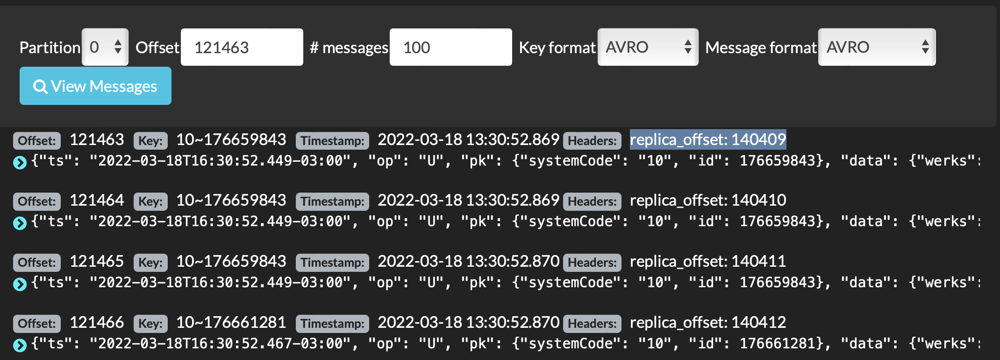

## Требования к AVRO схеме

Для топиков, которые пишутся в Avro формате, мы решили стандартизовать базовый формат сообщений (схему), правила именования полей и пространств, чтобы у подписчиков не было проблем с получением данных.

За основу взяли стиль для Java от Google:
- https://google.github.io/styleguide/javaguide.html#s5.2.1-package-names
- https://docs.oracle.com/javase/tutorial/java/package/namingpkgs.html

И получилось
- наименования (name) всех атрибутов должны быть в формате camelCase (состоять только из букв или цифр и не начинаться на цифру)
  и с учетом следующих требований:
  * Если у атрибута "type" - "record", то наименование (name) должно начинаться с большой буквы
  * Если у атрибута "type" не "record", то наименование (name) должно начинаться с маленькой  буквы
- атрибут "namespace" состоит из префикса "`ORG_NAME`." и `dataset name` (точки и тире удаляются, после них буква заменяется на заглавную)
- значение заглавного атрибута "name" должно начинаться с большой буквы.

Базовая (обязательная для всех) схема сообщений топика выглядит так:

```json
{
    "namespace": "__AVRO_ROOT_NAMESPACE__",
    "type": "record",
    "name": "__AVRO_ROOT_NAME__",
    "doc": "Example message",
    "fields": [
       {"name": "ts", "type": "string", "doc": "Время события в ISO 8601:2004 с указанием TZ"},
       {"name": "op", "type": {
                    "type": "enum", "name": "EnumOp", "namespace": "ORG_NAME",
                    "symbols": ["U", "D", "I"]
            }, "doc": "Вид операции [U]pdate, [D]elete, [I]nsert"
        },
        {"name": "pk",
         "type": {"type": "record", "name":"PkType", "namespace": "__AVRO_DATASET_NAMESPACE__",
            "fields":
            [
                { "name": "pkID", "type":"string"}
            ]
        },
         "doc": "Первичный ключ записи в виде структуры"
        },
        {
            "name": "sys",
            "type": ["null", {
                "name": "Sys", "namespace": "ORG_NAME",
                "type": "record",
                "fields": [
                    {"name": "seqID", "type": "long", "default": -1,"doc": "Монотонно возрастающий счетчик для проверки или восстановления оригинальной последовательности"},
                    {"name": "traceID", "type": "string", "default": "", "doc": "Сквозной Trace ID (обычно UUID)"}
                ]
            }],
            "default": null,
            "doc": "Системные поля, заполняемые источником"
        },
        {
            "name": "metadata",
            "type": ["null", {
                "type": "record",
                "name": "Metadata", "namespace": "ORG_NAME",
                "fields":[
                    {"name": "kafkaKeySchemaID","type": "int","default": -1, "doc":"Версия схемы ключа"},
                    {"name": "kafkaValueSchemaID","type": "int","default": -1, "doc": "Версия схемы значения"},
                    {"name": "kafkaKey","type": "string", "default": "", "doc": "Ключ в Kafka"},
                    {"name": "kafkaPartition","type": "int","default": -1, "doc": "Номер партиции"},
                    {"name": "kafkaOffset","type": "long","default": -1, "doc": "Offset в Kafka"},
                    {"name": "kafkaTimestamp","type": "string", "default": "", "doc":"Время сообщения в Kafka"},
                    {"name": "kafkaTopic","type": "string", "default": "", "doc":"Имя топика"},
                    {"name": "kafkaHeaders", "type": ["null", {"type": "map", "values": "string"}], "default": null}
                ]
            }],
            "doc": "Мета структура, заполняется Подписчиком после чтения",
            "default": null
        },
        {"name": "data",
         "type":["null",{
            "type": "record",
            "name": "RecordData", "namespace": "__AVRO_DATASET_NAMESPACE__",
            "fields":[
                {"name": "message", "type": "string", "doc": "Пример передачи строки message"}
                 
            ]
         }],
         "doc": "Полезная нагрузка"
        }
    ]
}
```

Где:
* __AVRO_ROOT_NAMESPACE__
  Корневой namespace. 
  Генерируется из `<dataset name>` путем замены всех `–` на `.` и добавления префикса `ORG_NAME.`.
  
  Пример: имя топика: `000-0.l3-hy.db.sales.order-confirmation.0`; корневой namespace: `ORG_NAME.l3.hy`.

* __AVRO_ROOT_NAME__
  Корневое имя.
  Генерируется как `<message type>`.`<data name>`.ver`<version>`, где первая и все буквы следующие за `.` или `-` заменяются на заглавные.
  
  Пример: имя топика: `000-0.l3-hy.db.sales.order-confirmation.0`; корневое имя: `DbSalesOrderConfirmationVer0`.

* __AVRO_DATASET_NAMESPACE__
  Namespace топика.
  Генерируется как корневой namespace + `<message type>`.`<data name>`.ver`<version>`, все `-` заменяются на `.`.
  
  Пример: имя топика: `000-0.l3-hy.db.sales.order-confirmation.0`; namespace топика: `ORG_NAME.l3.hy.db.sales.order.confirmation.ver0`.
    

Источник может расширять только структуру `pk` и `data`, сам корневой уровень не разрешается изменять.

Большинству подписчиков нужна мета информация к сообщению. С помощью нее можно проверить данные на предмет отсутствия пропусков, выстроить последовательность, точно указать на сообщение, в случае проблем. Мы решили сразу в схему заложить структуру под эту мета информацию, ее заполняет подписчик, если ему это надо.

Это решение позволило нам так же сохранять в Stage слой на Hdfs и в HBase в Avro формате с сохранением метаданных Kafka.

### Небольшие рекомендации по заполнению структуры data

Необходимо стараться сохранить исходную тип или не потерять в точности.

Тип float не подходит для передачи отчетных типов.

Возможные способы решения проблемы:
 * методом домножения на множитель и приведением к целочисленному типу.

   * Статический множитель: 
     
     пример:
     
     ```avro
     "name": "priceX10000", "type": "long", "doc": " Цена домноженная на 10000"
     ```

   * Динамический множитель:
   
     ```avro
     {"name": "price",
         "type": {"type": "record", "name":"Price", "fields":
            [
                { "name": "value", "type": "long", "doc":"Цена домноженная на multiplier"},
                { "name": "multiplier", "type": "int", "doc":"Множитель"},
            ]
        },
    ```
   
 * приведение к меньшим единицами измерения (в зависимости от точности измерений, а лучше - с запасом):  
     * целое число секунд вместо дробных часов
     * целое число метров вместо дробных километров 
## Хранилища

### Сервис по доставке сообщений из Kafka в базы данных

У нас довольно много систем, построенных на старых технологиях и которые не умеют читать из Kafka напрямую. Для них и для простых систем, мы сделали на NiFi сервис по доставке сообщений напрямую в базу данных.

Мы условились об одинаковом имени таблиц и обязательных колонках таблиц, чтобы сервис можно было пере использовать.

Запрос на вставку данных выглядит так:

```sql
INSERT INTO etl.kafka_data(name_topic,message,create_date,meta_offset,meta_partition,key_message) 
VALUES (?,?,?,?,?,?)
```

Соглашение по колонкам:

| Наименование | Тип (PostgreSQL) | Описание |
|------------|----------------|----------|
| meta_timestamp |	timestamp without time zone | время отправки сообщения в Kafka (заполняется клиентом при отправке) |
| meta_offset | bigint | внутреннее смещение в партиции |
| meta_partition | int | номер партиции |
| name_topic | text | имя топика |
| key_message | text | ключ сообщения (если указан) |
| message | text, json, jsonb | Тело сообщения в JSON |

Несмотря на то, что мы передаем в Json формате и, кажется, теряем преимущество Avro - типизацию, использование Schema Registry и ее гарантий эволюции схем позволяет быть уверенным, что тип поля не изменится.

Сейчас бы я так же добавил в эту таблицу версию схемы ключа и сообщения, которая использовалась при десериализации, как это сделано в охлаждении в Hadoop.

Сохранение метаданных Kafka в BD очень важно, т.к. позволяет проверить на дубли или пропуски данных.
Например, таким запросом можно проверить, что у нас не было пропусков данных за последние сутки (количество уникальных offset в рамках партици и топика равно разности максимального и минимального offset, минус один):

```sql
with stat as (
    select name_topic, meta_partition, min(meta_offset) as _min, max(meta_offset) as _max, count(distinct(meta_offset)) as n_msg
    from etl.kafka_data
    where created_at > now()- '1 day'::interval
    group by name_topic, meta_partition
)
select *,n_msg-(_max - _min)-1 as delta from stat where  n_msg-(_max - _min) <> 1
```

Сам шаблон NiFi представляет из себя два консьюмера: к продуктивной и тестовой Kafka, и цепочки процессоров до продуктивной БД и тестовой соответственно.
В связи с различными кейсами(например есть только продуктивная БД), когда надо было передать тестовый поток на продуктивную БД или наоборот, предусмотрена возможность задать правило со списком топиков для передачи в другую среду.

В новых версиях NiFi появилась отличная концепция - Parameter Contexts и все настройки мы выполняем через них:
- список топиков
- параметры подключения
- правила передачи данных между средами

Мы планируем предоставить управления Parameter Contexts через наш Портал, привязывая их к Информационным Системам, чтобы уйти от заявок в Self-Service.

Инструкция Администратора по созданию новой группы выглядит так:
1. переименовать
2. создать parameters такой же, как имя группы
3. добавить в PARAMETER INHERITANCE:
    * _postgresql_db | _oracle_db - тип целевой базы
    * kafka-clusters

4. Заполнить переменные в Parameters: 
   * 000_0_group_id: имя группы (`service-prod.nifi-000-0.sre.<group_name>`)
   * 000_0_topic_name_format: names
   * 000_0_topic_names: список топиков
   * 000_1_group_id: имя группы (`service-prod.nifi-000-0.sre.<group_name>`)
   * 000_1_topic_names: список топиков
   * prod_database_connection_url: `jdbc:oracle:thin:@<hostname>:1521/<service_name>`
   * test_database_connection_url: `jdbc:postgresql://<hostanme>:5432/<db>?ApplicationName=nifi-000-0-<group_name>`
   * test_to_prod_topics_re: `^$` - маска для передачи топиков с теста на прод
   * prod_to_test_topics_re: `^$` - маска для передачи топиков с прода на тест
   
Группа в NIFI выглядит так:
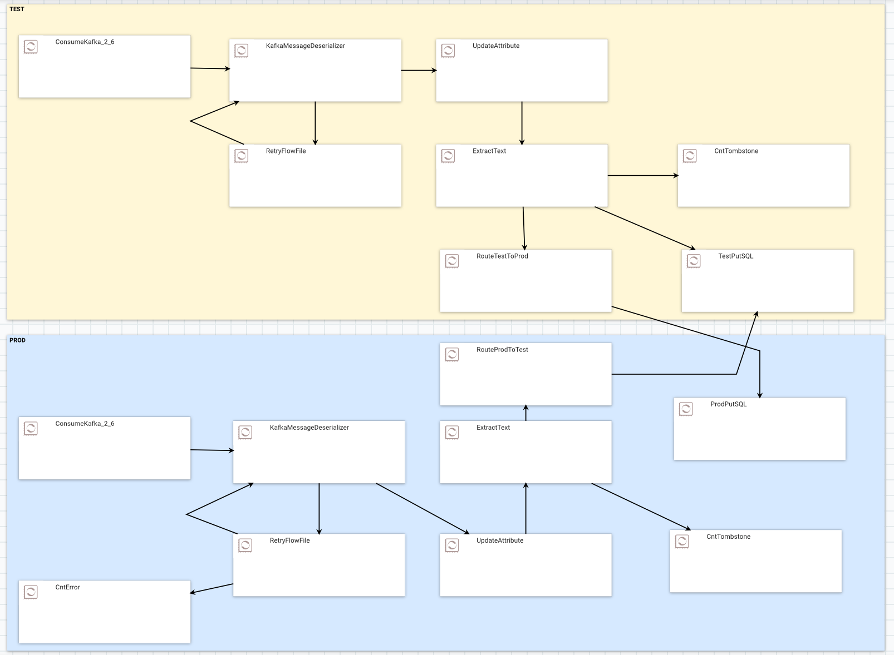


### Сырой слой в Hadoop

Прорабатывая построение Stage слоя в Hadoop мы хотели:
- предоставить возможность работать с данными из Hive
- сохранять метаданные из Kafka для сообщений
- поддержать концепцию эволюции схем

Мы попробовали сначала сложить сообщения из Kafka в Avro формате в Hbase, а метаданные в таблицу в Impala. Создав представление в Hive над таблицей в Hbase и соединив ее с метаданными из таблицы в Impala, мы получали бы представление, удовлетворяющее исходным требованиям.
Сначала показалось, что все работает...

Исходный flow в NiFi и описание таблиц(скорее для истории):
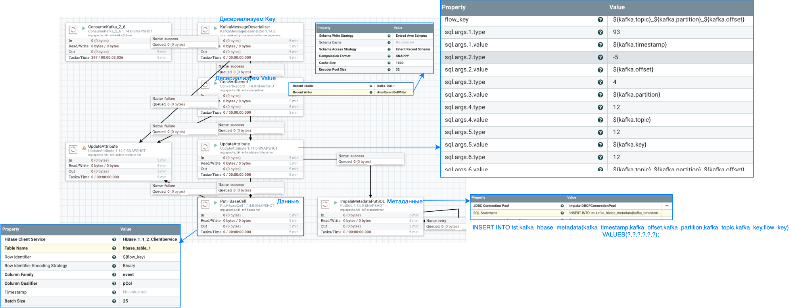

* Таблица в Hbase с данными(kafka.value в Avro), и ключом: `${kafka.topic}_${kafka.partition}_${kafka.offset}`.
* Внешняя таблица в Hive над ней:
  ```sql
  CREATE EXTERNAL TABLE tst.hbase_table_1
  ROW FORMAT SERDE 'org.apache.hadoop.hive.  hbase.HBaseSerDe'
  STORED BY 'org.apache.hadoop.hive.hbase.  H  BaseStorageHandler'
  WITH SERDEPROPERTIES (  
      "hbase.columns.mapping" = ":key,  even  t  :pCol",
      "event.pCol.serialization.type"   =   "a  vro",
      "event.pCol.avro.schema.url" = "  ht  tps:/  /schema-registry-000-1/subjects/000-1.  dwh.db.avro-evolution-hdfs.0-value/  versions/latest/schema"
  )  
  TBLPROPERTIES (  
      "hbase.table.name" = "hbase_table_1",  
      "hbase.mapred.output.outputtable" = "hbase_table_1",
      "hbase.struct.autogenerate" = "true"
  );
  ```
* Таблица в Impala, где для этого же ключа лежат метаданные и kafka.key.
  ```sql
  CREATE TABLE tst.kafka_hbase_metadata
  (
      kafka_timestamp TIMESTAMP,
      kafka_offset BIGINT,
      kafka_partition INT,
      kafka_topic STRING,
      kafka_key STRING,
      flow_key STRING
  ) STORED AS PARQUET;
  ``` 

  Запрос на соединение:
  ```sql
  select * from tst.kafka_hbase_metadata left join tst.hbase_table_1 ON (flow_key = key);
  ```

На маленьком объеме данных решение казалось рабочим, но с ростом количества данных мы заметили деградацию в производительности.
Проблема была с неработающим Predicate Pushdown для HBase таблиц, из HBase забирались все ключ, а не только те, что были в левой таблице.

Нам пришлось от этой схемы отказаться. 
Мы пришли к следующему подходу:
- добавили в схему сообщений структуру `metatadata` под метаданные Kafka и заполняем ее на NiFi после чтения
- решение с HBase оставили как экспериментальное, из Hive обращения к hbase не используются
- хранилище сделано на HDFS, сохраняем в Avro, из Hive создаем внешние таблицы

#### HDFS + Hive

Приземление данных из Kafka в HDFS также сделано на NiFi.
Обогатив сообщение метаданными из Kafka, NiFi мержит сообщения по атрибуту:
```
${kafka.topic}_${kafka.timestamp:format("yyyy-MM-dd")}_${kafka.schema_id.value}
``` 
в  пачки и сохраняет в HDFS по пути:
```
/dwh/${env}/stage/kafka-${cluster_name}/${kafka.topic}/dwh_dt=${now():format("yyyy-MM-dd", "GMT+3")}/
```

Данные партицированы по дате записи, чтобы позже обрабатывать именно дельту.
Формат данных: Avro со схемой.

Внешние таблицы мы создаем задачей в Airflow. По умолчанию создается таблица в `latest` версией схемы и каждую ночь мы обновляем схему из Schema Registry.
Условно, Dag выглядит так:

```python
hive_scheme = f"{env}_stage"
topic_list = [...]
for topic in topic_list:
        @task(task_id=topic)
        def hive_hook_test(topic_name):
            org_name_topic = ORGNAMEKafkaTopic(topic_name)
            table_name = "kafka_{}".format(topic_name.replace('.','_').replace('-','_'))
            hdfs_path = f"/dwh/{env}/stage/kafka-{org_name_topic.get_naming_attr('cluster_name')}/{topic_name}/"
            topic_scheme = org_name_topic.get_value_scheme(include_meta=True)
            table_ddl = f"""CREATE EXTERNAL TABLE IF NOT EXISTS
            {table_name}
            PARTITIONED BY (dwh_dt string)
            STORED AS AVRO 
            LOCATION '{hdfs_path}'
            TBLPROPERTIES (
                'avro.schema.literal'='{topic_scheme}'
            )
            """
            alter_ddl = f"""ALTER TABLE {table_name} SET TBLPROPERTIES (
                'avro.schema.literal'='{topic_scheme}'
            )
            """
            hh = SSLHiveServer2Hook(hiveserver2_conn_id=conn_id)
            with closing(hh.get_conn(hive_scheme)) as conn, closing(conn.cursor()) as cur:
                cur.execute(table_ddl)
                cur.execute(alter_ddl)
                cur.execute(f'MSCK REPAIR TABLE {table_name} SYNC PARTITIONS')
                cur.execute(f'MSCK REPAIR TABLE {table_name}')
```

#### HBase

В HBase на каждый кластер мы создаем по две таблицы: одна - для всех "публичных" топиков, и вторая для топиков типа `cdc` (compaction) (HBase повторяет логику работы compaction в Kafka и оставляем только последнее значение по ключу).
Эти таблицы различаются только ключом (Row Identifier).
В первом случае используется выражение: `${kafka.topic}_${kafka.timestamp}_${kafka.partition}_${kafka.offset}`
А во втором, просто ключ сообщения в Kafka: 
`${kafka.topic}_${kafka.key}`.

Сами таблицы имеют две CF (column family): под метаданные и под Avro (schema less) объект.
Таблицы предварительно создаются в HBase:
```
create 'kafka_stage_000-0', {NAME => 'metadata', COMPRESSION => 'SNAPPY',  VERSIONS => 1}, {NAME => 'data', IS_MOB => true, COMPRESSION => 'SNAPPY',  VERSIONS => 1};
create 'kafka_cdc_000-0', {NAME => 'metadata', COMPRESSION => 'SNAPPY',  VERSIONS => 3}, {NAME => 'data', IS_MOB => true, COMPRESSION => 'SNAPPY',  VERSIONS => 3};
```

Обратите внимание, что в отличие от Hive, где Avro объект сохарняется со схемой, в HBase хранится Avro без схемы. 

Пример, как читать такие таблицы из pyspark
```python
from pyspark import SparkConf, SparkContext
import json

sc.addPyFile("hdfs://dwh-prod/user/makarov_ia/sr_wrapper2.py")
from sr_wrapper2 import ORGNAMEKafkaTopic

topic_name = '000-0.l3-c.db.melt-steel-operation.1'
# Обертка для получения схемы из SR
org_name_topic = ORGNAMEKafkaTopic(topic_name)
value_avro_schema = org_name_topic.get_value_scheme(include_meta=False,clean_docs=True)

catalog = json.dumps(
  {
      "table":{"namespace":"default", "name":"kafka_stage_000-0"},
      "rowkey":"key",
      "columns":{
          "key": {"cf": "rowkey", "col": "key", "type": "string"},
          "kafkaKey": {"cf": "metadata", "col": "kafka_key", "type": "string"},
          "kafkaTopic": {"cf": "metadata", "col": "kafka_topic", "type": "string"},
          "kafkaSIDValue": {"cf": "metadata", "col": "kafka_schema_id_value", "type": "string"},
          "value": {"cf": "data", "col": "msg", "avro": "avroSchema"}
      }
  })


df = spark.read\
    .options(avroSchema=value_avro_schema)\
    .options(catalog=catalog)\
    .format("org.apache.hadoop.hbase.spark")\
    .option("hbase.spark.use.hbasecontext", False)\
    .load()

df.createOrReplaceTempView("tmp_1")
results = spark.sql("SELECT count(*) FROM tmp_1 WHERE key like '000-0.l3-c.db.melt-steel-operation.1%' LIMIT 1")
#results.explain(extended=True)
results.show(10, False)
#print(value_avro_schema)
spark.catalog.dropTempView("tmp_1")
```

## Портал

Как выше говорилось, наша цель - полностью автоматизировать работу пользователей с платформой и Kafka, в частности, плюс, как можно больше проверок сделать на начальном этапе.

Мы сделали сервис Портала, который умеет:
- генерировать базовую схему для топика
- проверять схему на соответствие стандартам
- проверять на типовые ошибки с AVRO ([тип default значения должен быть таким же, как и первый тип в перечислении type](https://avro.apache.org/docs/current/spec.html#schema_complex), генерируемость Java классов и схем без ошибок) и качество схем(отсутствие документации у полей)
- проверять на совместимость

Также этот сервис предоставляет rest api для возможности автоматизаций на стороне отправителя.

Мы планируем уйти от регистрации схем через Kafka REST, регистрация и эволюция схем будет возможна только через наш сервис.

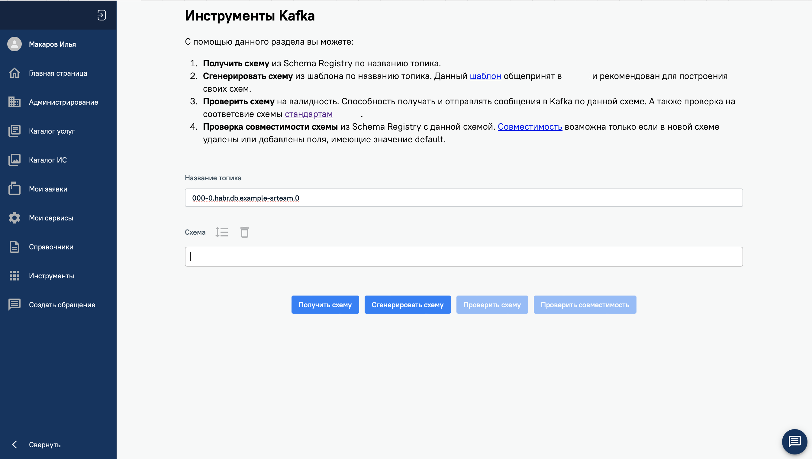


## Сервис по выгрузке семплов

В компании много систем, которые не умеют напрямую работать с Kafka, например Oracle или 1С. Для таких систем мы централизованно предоставляем сервис по доставке сообщений: кладем напрямую в БД или через REST.
И одним из частых запросов было "выгрузите нам примеры сообщений". Для решения этой задачи мы на нашем портале сделали сервис по выгрузке семплов, он позволяет для заданных по маске топикам делать выгрузки семплов. Запросить можно топики с типом MessageType "Публичный".
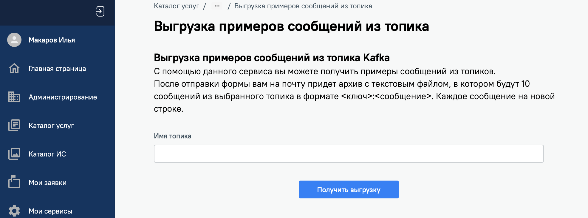


# Планы
- гибкое управление настройками топиков, в том числе по паттернам (например, для всех топиков типа cdc включить compaction), на основании статистики (резкий рост количества получаемых сообщений  -  выставить ограничение на объем партиции с учетом текущей утилизации места кластера). Текущий скрипт обладает только базовыми функциями: [kafka-mgm](https://github.com/e11it/kafka-mgm)
- [Cruise Control](https://github.com/linkedin/cruise-control). С ростом кластера это становится все более актуальным
- Kerberos на централизованных кластерах
- Keyclock OAuth  на централизованных кластерах. Чтобы не мучиться с сертификатами и для интеграции с LDAP. (У нас были попытки использовать SASL/OAUTHBEARER для Kafka два года назад, но не хватило времени на тестирование и надо было написать примеры приложений, чтобы разработчикам было проще начать использовать. Мы так же столкнулись с тем, что не все библиотеки поддерживали OAuth, но сейчас, кажется, уже дело обстоит гораздо лучше. Спасибо [Strimzi](https://strimzi.io))

# А выводы

Качественное внедрение и адаптация под компанию любой системы - длительный процесс:  вы автоматизируете все что возможно, пишете документацию, примеры кода, нарабатываете экспертизу, постоянно дорабатывая методологию и подходы. 
Понимание, как это сделано в других компаниях, позволяет двигаться быстрее и делать более удобные информационные системы.
Я горжусь тем, как мы сделали и что у нас получилось.
Ну а совершенству нет предела!
